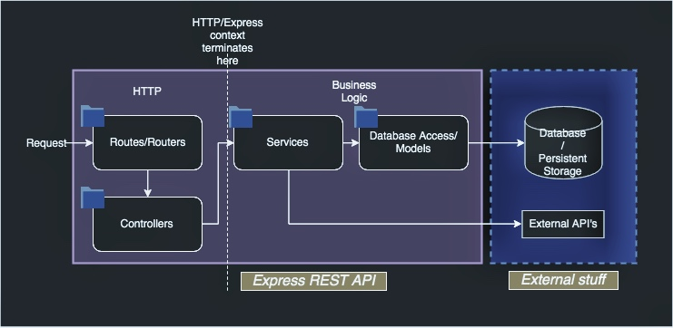

# eCommerce REST API

[](https://travis-ci.com/gboyegadada/ecommerce-api)

A REST API based on NodeJS, Express, MySQL, and Knex using JSON Web Tokens (JWT) for authentication.

# Quick Start

1. Clone the repo and navigate to project root 

2. Copy `.env.example` to `.env`

3. Then run:
    ```bash
    $ docker-compose up -d
    ```

## URLs
- API: 
    ```bash
    http://localhost:49160
    ```
- Docs: 
    ```bash
    http://localhost:49160/docs
    ```
- MySQL: 
    ```bash
    $ mysql -u root -h localhost -Dapp -P 33062
    ```


# Project structure


## Architecture

This is an API first monolith app that uses a typical MVC flow. To improve performance I chose not use an ORM for the models but to use a query builder instead. Models are in `/repositories`, while Controllers are in `/controllers`. There are no views as they do not really apply here.



## Technologies 

### Server 
- NodeJS + Express JS
- PM2 for process management and clusters
- MySQL with Knex query builder for database
- Redis for caching and for rate limiter middleware
- `compression` node library for gzip compression
- `helmet` node library for header security

### Development
- Docker containers (app, redis and mysql) with Docker Compose
- Travis CI for integrated tests on pull requests
- Snyk for npm package vulnerability scans
- Mocha with Istanbul for testing and test coverage reporting
- Bash scripts for docker compose hooks (e.g. waiting for MySQL container before running the server)

# Adnvanced Requirements
This is my first Node JS backend project (I use PHP with Symfony at work). Also it is hard to clearify what the "current" system can support without knowing it's architecture, technologies used and available resources but I tried to do a little research:

1. **The current system can support 100,000 daily active users. How do you design a new system to support 1,000,000 daily active users?**
    - Node JS is considered to be generally fast and efficient (which is why I chose it even though I have more experience with PHP)
    - Avoid ORMs if possible because complex ORM calls can be Inefficient
    - On database side, separating the objects (e.g. products) into a few different collections: all, most liked, newest, newest in stock and so forth. Whenever an item gets added, liked or ordered, the code checks if it (still) belongs to one of those collections and acts accordingly. This way the code can query from prepared collections instead of running complicated queries on one huge pile.
    - Upload images to cloud storage like Google or AWS S3
    - Use caching with Redis or in-memory
    - Don’t use synchronous functions
    - Implement gzip compression at a reverse proxy level
    - Do not use `console.log()` or `console.error()` in production because they are synchronous functions (use a logging library like Winston or Bunyan)
    - Running the app in a cluster and using a load balancer
    - Use a process manager like PM2 or StrongLoop

2. **A half of the daily active users comes from United States. How do you design a new system to handle this case?**
    
    - I have no experience deploying an app with this kind of request volume but I would say maybe dedicate a larger cluster (with auto-scaling) to that region (in AWS for example) and a smaller cluster to less demanding regions.

