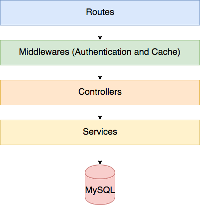
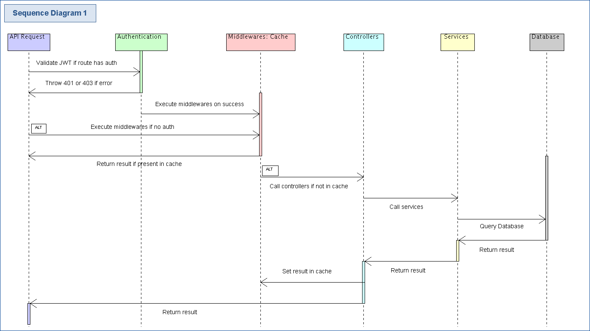
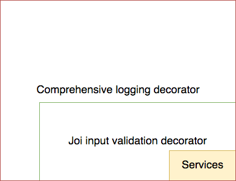
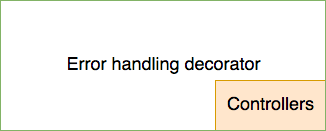
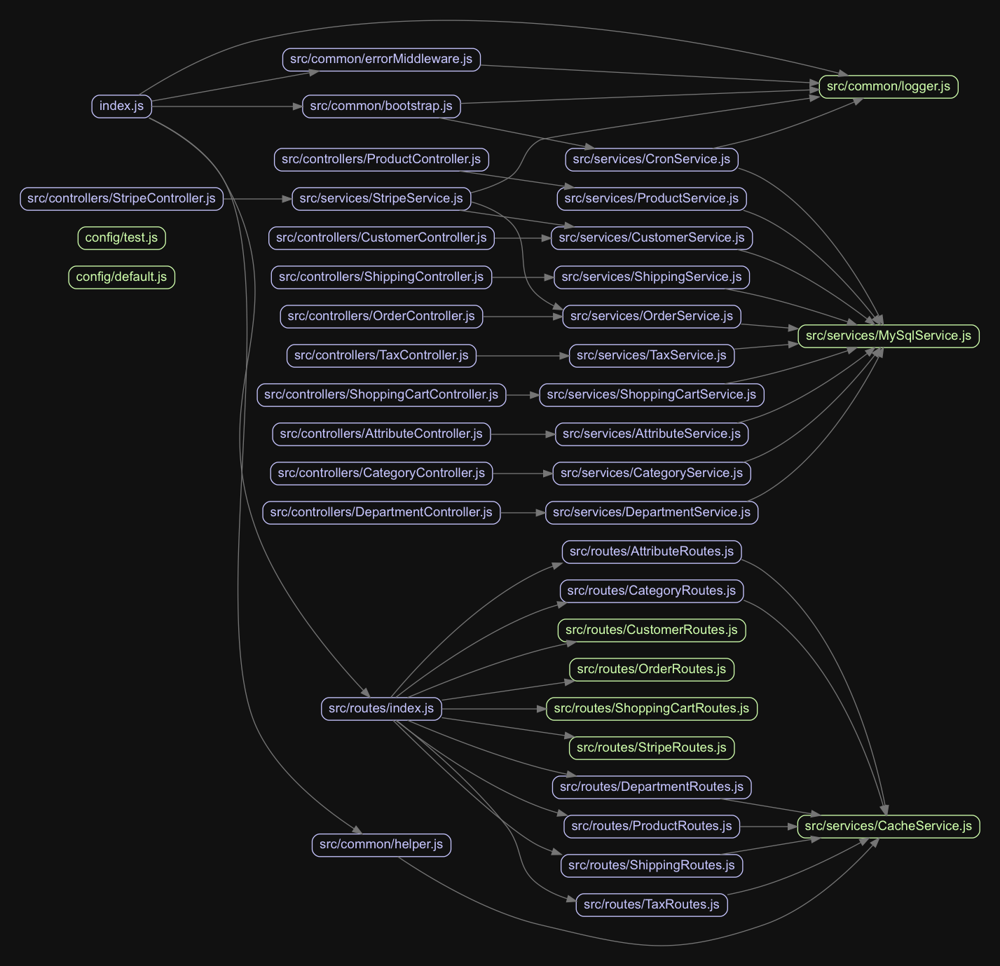

# Architecture

## Code structure
 
 The server uses a layered architecture.

 

 The three main layers are,
 1. Routes
 2. Controllers
 3. Services

Routes define objects which specify handlers, authentication and authorization for a uri.
For instance, a route object to update a customer's address would be defined as,
```
'/customers/address': {
    put: {
      controller: 'CustomerController',
      method: 'updateCustomerAddress', // The controller method to handle this request
      auth: 'jwt', // Method of authentication
      access: ['User'] // The authorization level
    }
  }
```

Controllers bridge the gap between routes and services. They extract relevant data for the services and format the result from the services to send back to the client.
`CustomerController.updateCustomerAddress` would be,
```
async function updateCustomerAddress(req) {
  await CustomerService.updateCustomerAddress(req.authUser.userId, req.body)
}
```

Services contain the core business logic.
`CustomerService.updateCustomerAddress` would be,
```
/**
 * Update address
 * @param {Number} customerId 
 * @param {Object} addressData 
 */
function updateCustomerAddress(customerId, addressData) {
  const { address_1, address_2 = '', city, region, postal_code, country, shipping_region_id } = addressData
  return dbPool.query(`call ${STORED_PROCEDURES.UPDATE_CUSTOMER_ADDRESS}(?, ?, ?, ?, ?, ?, ?, ?)`, [customerId, address_1, address_2, city, region, postal_code, country, shipping_region_id])
}
updateCustomerAddress.schema = {
  customerId: Joi.number().integer().required(),
  addressData: Joi.object().keys({
    address_1: Joi.string().required(),
    address_2: Joi.string(),
    city: Joi.string().required(),
    region: Joi.string().required(),
    postal_code: Joi.string().required(),
    country: Joi.string().required(),
    shipping_region_id: Joi.number().integer().required()
  }).required()
}
```

## Sequence diagram

All api requests follow this flow,



## Decorators

### Service decorators



I've used `joi` for input validation. Each service method has a schema attached to it (`updateCustomerAddress.schema` above for instance). A decorator function wraps the service and evaluates the schema with the service method's input arguments before calling the actual service method. You will find the relevant code in `src/common/bootstrap.js -> decorateWithValidators`

If log level is set to `debug`, a decorator which provides comprehensive logging is enabled and wraps the decorator for `joi`.

### Controller decorator



Each controller is wrapped inside an error handling and result parsing decorator.


## App configuration

All app configuration is handled in `config/defaults.js` using the `config` module.

## Dependency graph

Dependencies between modules,




## Other notes

1. **Winston** logs are written to `error.log` and `combined.log` for analysis

2. **Passwords** are hashed using `bcrypt`.

3. **JWT tokens**: Users are authenticated and authorized using JWT. A field in the jwt payload is `roles`. This can have the various authorization levels. At the moment, I have used `User` and `Administrator` roles (see the `optional` branch). You can define more roles by updating `config/default.js -> JWT.ROLES`.

  These roles directly map to the `access` field defined for each route requiring authentication. `CustomerRoute.js` for instance.

  The `optional` branch has more routes with `Administrator` and `User` access levels operating together.

  The auth check happens `index.js`. It uses `tc-core-library` which populates `req.authUser` with the jwt payload. 
  ```
  ...
  actions.push((req, res, next) => {
        // authenticator validates jwt and creates "req.authUser"
        authenticator({
          AUTH_SECRET: config.get('JWT.AUTH_SECRET'),
          VALID_ISSUERS: config.get('JWT.VALID_ISSUERS')
        })(req, res, next)
      })
  ```
  Once that is done, just check if `req.authUser.roles` has `route.access`. 

4. **Datadog**: I've enabled opentracing with the datadog agent. It measures performance for each route.

5. **Cache**: An ideal solution would be to use `redis` or `memcached` for a distributed production environment. For the purpose of this challenge however, I've only added a simple cache with `node-cache` for important non authenticated routes.

6. **Cron**: A cron service runs everyday at midnight (`config/default.js -> CRON.CRON_TIME`) to clear out unused shopping carts.

7. **Configuration options** can be provided via environment variables instead of hardcoding sensitive information in `config/default.js`. It uses `process.env` to check for passwords / secret keys before using the hardcoded value.

8. **Request throttling** is enabled using `express-rate-limit`.

Please see `AdvancedRequirements.md` for potential solutions for scaling.